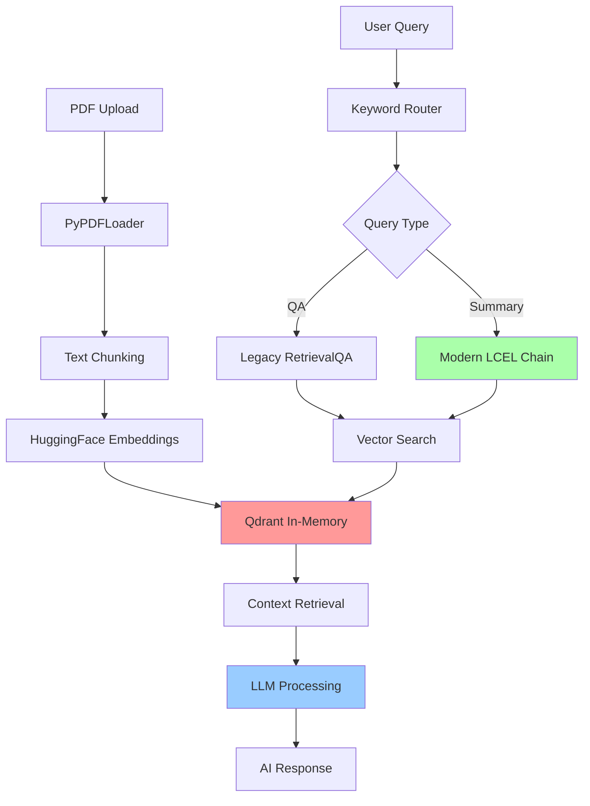

# 🏦 Finance Chat Application

[](https://opensource.org/licenses/MIT)
[](https://www.python.org/downloads/)
[](https://fastapi.tiangolo.com/)
[](https://github.com/rohitkhattar/finance-aichat-app/stargazers)
[](https://github.com/rohitkhattar/finance-aichat-app/issues)
[](https://github.com/rohitkhattar/finance-aichat-app/actions)

An AI-powered finance document analysis application built with **FastAPI**, **LangChain**, and **Qdrant in-memory**. Upload PDF documents and chat with them using natural language queries - no Docker required!


## ✨ Features

- 🏦 **AI-Powered Financial Analysis** - Ask complex questions about your financial documents
- 📄 **PDF Upload & Processing** - Automatic text extraction and vector embedding creation
- 🧠 **Intelligent Document Q&A** - Context-aware responses using RAG (Retrieval-Augmented Generation)
- 📊 **Document Summarization** - Generate intelligent summaries of financial reports
- 💾 **Qdrant In-Memory Storage** - High-performance vector storage without external dependencies
- 🚀 **RESTful API** - Complete FastAPI backend with auto-generated documentation
- 💻 **Interactive Client** - User-friendly command-line interface
- 🔄 **Real-time Processing** - Instant responses with hot-reload development mode

## 🏗️ Technical Architecture



## 🔧 Technical Components

### **Core Components**
| Component | Technology | Purpose |
|-----------|------------|---------|
| **Web Framework** | FastAPI | REST API endpoints, auto documentation |
| **Vector Database** | langchain-qdrant | Vector storage and similarity search |
| **Document Loader** | PyPDFLoader | PDF text extraction and parsing |
| **Embeddings** | HuggingFace BGE-small | Text-to-vector conversion (384 dimensions) |
| **LLM Integration** | Groq/OpenAI | Natural language processing and generation |
| **Text Splitting** | RecursiveCharacterTextSplitter | Optimal chunk creation (800 chars, 200 overlap) |

### **AI Pipeline**
1. **Document Processing**: PDF → Text → Chunks → Embeddings → Vector Storage
2. **Query Processing**: User Query → Intent Detection → Vector Search → Context Retrieval
3. **Response Generation**: Context + Query → LLM → Structured Response

## 🚀 Quick Start

### **Prerequisites**
- Python 3.8+
- API key from Groq (free) or OpenAI (paid)

### **Installation Steps**

```bash
# 1. Clone the repository and navigate to the directory
git clone https://github.com/rohitkhattar/finance-aichat-app.git
cd finance-aichat-app

# 2. Create and activate a virtual environment
python3 -m venv .venv
source .venv/bin/activate

# 3. Install dependencies
pip install -r requirements.txt

# 4. Set up environment variables
cp env_example.txt .env

# 5. Edit .env file and add your API key
# Option 1: Groq (Free and Fast)
GROQ_API_KEY=your_groq_api_key_here

# Option 2: OpenAI (Paid)
# OPENAI_API_KEY=your_openai_api_key_here

# 6. Start the application
python main.py
```

### **Getting API Keys**
- **Groq (Recommended - Free)**: Visit [console.groq.com](https://console.groq.com)
- **OpenAI (Paid)**: Visit [platform.openai.com](https://platform.openai.com)

## 📖 Usage Guide

### **Web Interface**
Once started, access these endpoints:
- **Main Application**: http://localhost:8000
- **Interactive API Docs**: http://localhost:8000/docs
- **ReDoc Documentation**: http://localhost:8000/redoc

### **Command Line Interface**

#### **Upload Documents**
```bash
# Upload a PDF document
python finance_chat.py upload /path/to/financial_report.pdf

# Example with real file
python finance_chat.py upload NVIDIA-Q1-FY26-Financial-Results.pdf
```

#### **Interactive Chat Mode**
```bash
# Start interactive mode (recommended for exploration)
python finance_chat.py

# This will show:
# 🏦 Finance Chat Interactive Mode
# Available collections and guided interaction
```

#### **Direct Questions**
```bash
# Ask specific questions
python finance_chat.py chat collection_name "What was the revenue for Q1?"

# Real example
python finance_chat.py chat nvidia-q1-fy26-financial-results "What was NVIDIA's revenue for Q1 FY26?"
```

#### **List Collections**
```bash
# See all uploaded documents
python finance_chat.py list
```

## 💡 Sample Queries

### **Financial Metrics**
```bash
"What was the total revenue for Q1 2024?"
"What is the net income and profit margin?"
"Show me the cash flow statement highlights"
"What are the key financial ratios?"
```

### **Business Analysis**
```bash
"What are the main business segments and their performance?"
"What were the key growth drivers this quarter?"
"What risks and challenges are mentioned?"
"How does this quarter compare to the previous year?"
```

### **Document Exploration**
```bash
"Give me a summary of this financial report"
"What is this document about?"
"What are the main topics covered?"
"Extract the key financial highlights"
```

### **Specific Data Points**
```bash
"What is the total debt and debt-to-equity ratio?"
"How many employees does the company have?"
"What was spent on R&D this quarter?"
"What are the geographic revenue breakdowns?"
```

## 🛠️ API Endpoints

### **Core Endpoints**

| Method | Endpoint | Description | Example |
|--------|----------|-------------|---------|
| `GET` | `/` | Application status | Health check and info |
| `POST` | `/upload_pdf` | Upload PDF document | File upload via form-data |
| `POST` | `/fin_chat` | Chat with document | Query processing |
| `GET` | `/collections` | List all collections | Document inventory |
| `GET` | `/collection/{name}/info` | Collection details | Metadata and stats |

### **API Examples**

#### **Upload PDF**
```bash
curl -X POST "http://localhost:8000/upload_pdf" \
     -F "file=@financial_report.pdf"
```

#### **Chat Query**
```bash
curl -X POST "http://localhost:8000/fin_chat?collection_name=report&message=What%20was%20the%20revenue?"
```

#### **List Collections**
```bash
curl "http://localhost:8000/collections"
```

## 🔬 Implementation Details

### **Vector Storage Configuration**
- **Database**: Qdrant in-memory mode
- **Vector Dimensions**: 384 (BGE-small-en-v1.5)
- **Distance Metric**: Cosine similarity
- **Chunk Size**: 800 characters with 200 character overlap

### **LLM Configuration**
- **Primary**: Groq Llama3-8B-8192 (fast, free)
- **Fallback**: OpenAI GPT-3.5-Turbo (paid)
- **Max Tokens**: Optimized for financial document analysis

### **Query Routing Logic**
```python
# The agent uses a simple keyword-based router.
# The summary tool has been modernized to use LangChain Expression Language (LCEL).

# Simplified view of the summary chain:
summary_prompt = PromptTemplate.from_template("Summarize: {content}")
summary_chain = summary_prompt | llm

# Simplified view of the QA chain (still uses legacy RetrievalQA):
qa_chain = RetrievalQA.from_chain_type(llm=llm, retriever=retriever)

def agent_logic(message: str) -> str:
    message_lower = message.lower()
    summary_keywords = ["summary", "summarize", "overview"]
    
    if any(keyword in message_lower for keyword in summary_keywords):
        # The summary tool invokes an LCEL chain.
        docs = retriever.invoke("summary content")
        content = "\\n".join(d.page_content for d in docs)
        return summary_chain.invoke({"content": content})
    else:
        # The QA tool invokes a legacy chain.
        return qa_chain.invoke({"query": message})
```

### **Error Handling**
- Comprehensive exception handling at all levels
- Graceful degradation for missing documents
- User-friendly error messages
- API validation and sanitization

## 📁 Project Structure

```
finance-chatapp/
├── .venv/                  # Isolated Python virtual environment
├── app.py                 # Main FastAPI application
├── main.py               # Application entry point
├── finance_chat.py       # Command-line client interface
├── requirements.txt      # Python dependencies
├── .env                 # Environment configuration
├── env_example.txt      # Environment template
├── README.md            # This documentation
└── data/                # Auto-created for any local storage (if needed)
```

## 🐛 Troubleshooting

### **Common Issues**

#### **Server Won't Start**
```bash
# Make sure you're in the right directory
cd finance-chatapp
python main.py
```

#### **PDF Upload Fails**
- Ensure PyPDF is installed: `pip install pypdf`
- Check file is a valid PDF
- Verify file size is reasonable (<100MB)

#### **No API Response**
- Verify API key is set in `.env`
- Check server is running on http://localhost:8000
- Ensure collection exists before querying

#### **Import Errors**
```bash
# Ensure your virtual environment is active
source .venv/bin/activate

# Reinstall dependencies inside the virtual environment
pip install -r requirements.txt --upgrade
```

### **Performance Optimization**
- For large documents, consider increasing chunk size
- For faster responses, use Groq instead of OpenAI
- Monitor memory usage with many documents (in-memory storage)

## 🚦 Environment Variables

| Variable | Required | Description | Example |
|----------|----------|-------------|---------|
| `GROQ_API_KEY` | One of these | Groq API key (recommended) | `gsk_...` |
| `OPENAI_API_KEY` | One of these | OpenAI API key | `sk-...` |

## 🧪 Testing

### **Automated Tests**
```bash
# Test server health
curl http://localhost:8000/

# Test collection listing
curl http://localhost:8000/collections

# Test client functionality
source .venv/bin/activate
python finance_chat.py list
```

### **Manual Testing Workflow**
1. Activate environment: `source .venv/bin/activate`
2. Start server: `python main.py`
3. Upload document: `python finance_chat.py upload sample.pdf`
4. Ask question: `python finance_chat.py chat collection_name "test query"`
5. Check web interface: http://localhost:8000/docs

## 🤝 Contributing

1. Fork the repository
2. Create a feature branch: `git checkout -b feature-name`
3. Make changes and test thoroughly
4. Commit changes: `git commit -m "Add feature"`
5. Push and create pull request

## 📊 Performance Metrics

- **Document Processing**: ~1-2 seconds per MB
- **Query Response**: 2-5 seconds (depends on LLM)
- **Memory Usage**: ~100MB + document size
- **Concurrent Users**: Limited by system memory

## 📄 License

This project is licensed under the MIT License.

## 🆘 Support

### **Getting Help**
1. Check this README for setup instructions
2. Review the troubleshooting section
3. Test with provided sample queries
4. Verify all dependencies are installed

### **Known Limitations**
- In-memory storage: Data lost on restart (by design)
- Single-threaded processing for uploads
- Memory usage scales with document size
- API rate limits depend on chosen LLM provider

---

**🎉 Ready to analyze your financial documents with AI!**

For questions or issues, please check the troubleshooting section first. This application has been tested with real financial documents and provides accurate, insightful analysis. 